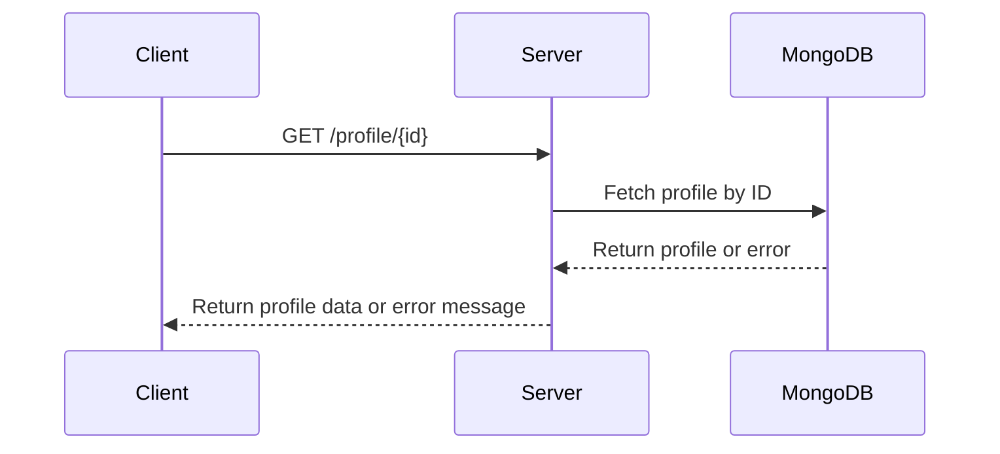
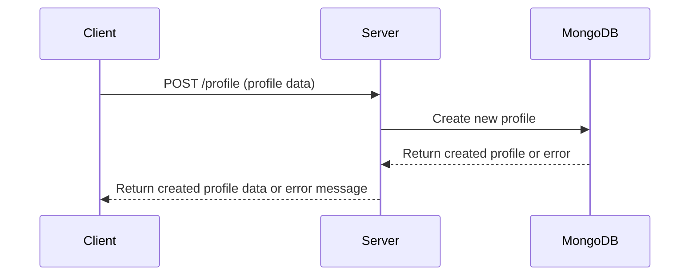
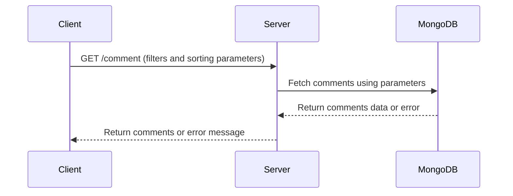
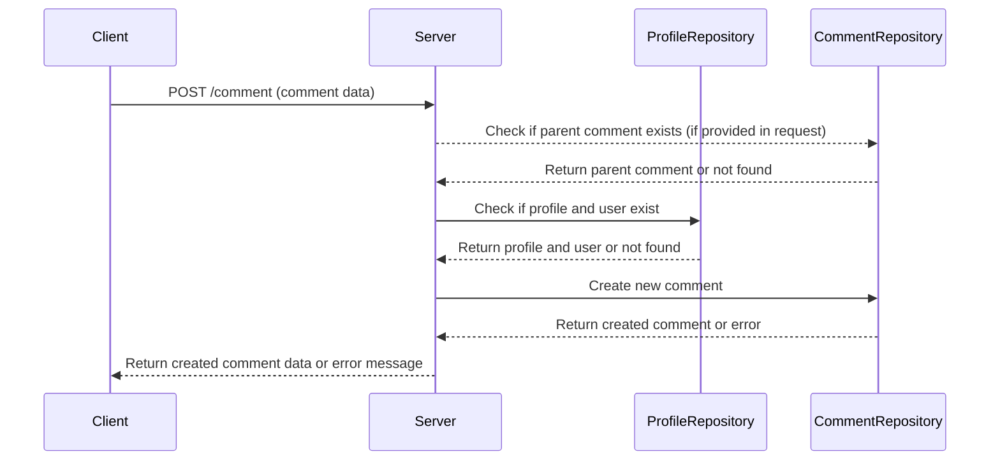
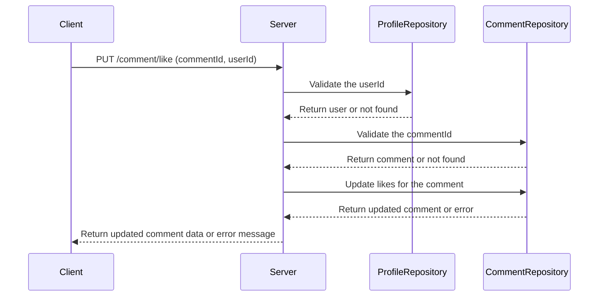

# Profile Voter
## Part 1:
- Store the profile data in a MongoDB database instead of in memory. For testing ease, use `mongodb-memory-server` (https://github.com/nodkz/mongodb-memory-server) instead of connecting to an external database.
- Add a POST route for creating new profiles. Note: you can reuse the same image for all profiles. Picture uploads are not necessary.
- Update the GET route to handle profile IDs in the URL. The server should retrieve the corresponding profile from the database and render the page accordingly.

## Part 2:
- Implement a backend API that supports the commenting and voting functionality described in the Figma: https://www.figma.com/file/8Iqw3VwIrHceQxaKgGAOBX/HTML%2FCSS-Coding-Test?node-id=0%3A1
- Frontend implementation is not necessary. Assume that the frontend will call your backend API to create user accounts, post comments, get/sort/filter comments, and like/unlike comments.
- Secure auth or picture uploads are not required. The only attribute needed for user accounts is `name`. Assume that anyone can access and use any user account.
- All data should be stored in the same database used in Part 1.

## Part 3:
- Add automated tests to verify the Part 1 and Part 2 implementations.

# Functional Requirement

## Profile Endpoint
- The system must be able to retrieve a profile by ID.
- The system must be able to create a new profile.
- The system must be able to handle a profile ID that doesn't exist or is invalid.
- The system must be able to handle potential errors during profile creation.

## Comment Endpoint
- The system must be able to create a new comment for a specific profile.
- The system must be able to retrieve comments related to a specific profile, with optional filtering and sorting parameters.
- The system must be able to handle potential errors during comment creation.
- The system must be able to comment / reply to other comment.
- The system must be able to like/unlike a comment by a specific user.

## General
- The system must use MongoDB handled by `mongodb-memory-server` for data storage `test` and use container `mongo` image for data storage `development` and `production`
- The system must run automated tests to verify implementation parts.

## Non-Functional Requirements
- The system should have good performance and fast response times.
- The system should have good error handling and logging mechanisms for easier debugging and maintenance.

# Key Assumptions
- The service run in the internal network which can't be accessed publicly. And the authentication handled by API Gateway and Authentication service.
- The system will respond content in application/JSON format as the most common backend response, `GET /profile/:id` **endpoint is just an exception because** the template example already there.
- The system test is integration test, it focused on interaction between different parts of system, it's aiming to expose the faults, defects, or bugs that can exist in the interfaces and interaction between integrated components/modules.

# Sequence Diagram
## GET /profile/:id

## POST /profile

## GET /comment

## POST /comment

## PUT /comment/like

# Running BackEnd locally
** Note : You can't run multiple environments at the same time on the same local machine.
## Prerequisites:
- install dependencies: `npm install`
## Development Environment
- run mongo-db container `$ docker-compose up`
- run app `$ npm run dev`
## Production Environment
- run mongo-db container `$ docker-compose up`
- run app `$ npm run prod`
## Development Environment
- `$ npm run test`